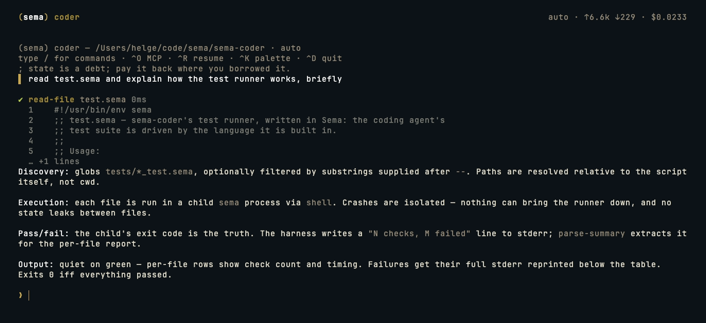

<div align="center">


# Sema Coder

**A terminal coding agent written almost entirely in [Sema](https://sema-lang.com)** — a Lisp with first-class LLM primitives.

[](LICENSE)
[](https://sema-lang.com)
[](https://sema-lang.com)

</div>

Sema Coder is the reference application for **Sema as an application runtime**: the
agent loop, tools, slash commands, the full-screen TUI, theming, and config all
live in Sema. Only a thin layer of host primitives (terminal screen control, path
safety) is Rust. It depends on nothing but the `sema` binary.



## Requirements

- **`sema` ≥ 1.30** — install with
  `curl -fsSL https://sema-lang.com/install.sh | sh` (or
  `brew install helgesverre/tap/sema-lang`, or `cargo install sema-lang`;
  see the [sema README](https://github.com/sema-lisp/sema#installation)).
- **An API key** — `ANTHROPIC_API_KEY` or `OPENAI_API_KEY` in the environment.
- Optional: **`rg`** (ripgrep) — the grep tool prefers it, falling back to `grep`.

## Run

```bash
# Interactive (full-screen TUI on a TTY)
./coder.sema                     # or: sema coder.sema

# One-shot (prose to stdout, pipeable)
./coder.sema -- -p "explain this codebase"

# Override the model
./coder.sema -- -m claude-haiku-4-5-20251001
```

`./coder.sema` works because the file is `chmod +x` with a `#!/usr/bin/env sema`
shebang.

## Architecture

```
sema-coder/
├── coder.sema          Entry point — CLI parsing, boot, REPL/TUI dispatch
├── src/
│   ├── agent.sema      System prompt + agent construction
│   ├── banner.sema     Wordmark + welcome (on-brand gold)
│   ├── cli.sema        Argument parsing + usage text
│   ├── commands.sema   Slash-command registry + built-ins
│   ├── config.sema     Config loading (init.sema as Sema data)
│   ├── display.sema    Output sink (emit) + tool-call rendering
│   ├── keymap.sema     Global shortcuts, rebindable via config
│   ├── markdown.sema   Markdown → styled terminal lines
│   ├── mcp.sema        MCP client runtime (connect, tool-merge, autostart)
│   ├── overlay.sema    Modal overlays — MCP manager + session picker
│   ├── session.sema    Session persistence — conversations as JSONL
│   ├── text.sema       Width-aware clip/pad/truncate string helpers
│   ├── theme.sema      Brand palette (sema gold #c8a855)
│   ├── tools.sema      7 LLM-callable tools
│   ├── transcript.sema Transcript blocks → styled lines (cached)
│   ├── tui.sema        Full-screen TUI — frame-diffed, async agent turns
│   └── util.sema       Workspace path resolution + shell quoting
├── test.sema           Test runner (Sema running Sema)
├── tests/              The test files + harness
└── docs/               Design notes; dated plans live in docs/plans/
```

It is built on Sema's own primitives: `defagent` / `deftool` / `agent/run` (the
LLM agent loop), `async` / `async/cancel` (concurrent turns), `make-parameter` /
`parameterize` (the command registry), `mutable-array/*` (the streaming
transcript), `file/*` and `shell` (tools), `json/*` (config), `term/*` (theming +
screen control), `path/within?` (workspace path resolution), `llm/session-usage`
(token/cost HUD).

In the TUI, an agent turn runs as an async task while a sibling task keeps pumping
input, so scrolling, resize, and type-ahead all work while tokens stream in, and
**Ctrl-C interrupts the turn** without killing the app.

## Slash commands

Built-ins: `/help`, `/model [name]`, `/clear`, `/tools`, `/mcp`, `/resume`,
`/cwd`, `/config`, `/reload`, `/quit`, `/exit`. In the TUI, type `/` to open a
fuzzy command palette. Add your own in config (see below).

## Configuration

Config is **Sema data, not JSON** — an `init.sema` file that calls
`(configure! (coder-config {…}))`. It is created (annotated) on first run,
**hot-reloads on save** (edit it in any pane; a banner shows and the last-good
config keeps running if a save doesn't parse), and lives at:

```
<config-dir>/sema/sema-coder/init.sema
```

`<config-dir>` is the OS default (`~/Library/Application Support` on macOS,
`$XDG_CONFIG_HOME` or `~/.config` on Linux). Overrides, in order: the
`SEMA_CODER_CONFIG_DIR` environment variable, then the OS default. Run `/config`
to print the exact path, or `/config edit` (or `e` in the `⌃O` modal) to open it.

A complete `init.sema`:

```sema
(configure!
  (coder-config
    {:model      ""          ; "" = auto-detect from API keys; or e.g. "claude-sonnet-5"
     :max-turns  50          ; max tool-use rounds in a single turn
     :tool-preview-lines 5   ; result lines shown under each tool call

     ;; MCP servers — each is a value; manage connections in the /mcp modal (⌃O).
     :mcp-servers
     (list
       ;; stdio: a local process speaking MCP over stdin/stdout
       (mcp-server "sema" {:command "sema" :args ["mcp" "--include" "eval,docs,docs_search"]
                           :autostart #t})           ; connect at boot
       ;; http: a remote endpoint (OAuth is prompted when you connect)
       (mcp-server "asana" {:url "https://mcp.asana.com/mcp"}))

     ;; Custom slash commands — argv (no shell), a template, or a Sema handler.
     :commands
     (list
       (command "test" {:desc "run tests"    :run ["make" "test"]})
       (command "log"  {:desc "git log"      :run ["git" "log" "--oneline" "-n" :args]})
       (command "diff" {:desc "wc diff"      :shell "git diff $ARGS"})
       (command "hi"   {:desc "greet"        :do (lambda (state args) (emit :info "hi!") state)}))

     ;; Rebind any keyboard action (defaults shown in the table below).
     :keys {}}))               ; e.g. {:mcp "ctrl-p" :resume "ctrl-y"}
```

| Key | Default | Meaning |
| --- | --- | --- |
| `:model` | `""` | LLM model; `""` auto-detects from `ANTHROPIC_API_KEY` / `OPENAI_API_KEY` |
| `:max-turns` | `50` | Max agent tool-use rounds per user turn |
| `:tool-preview-lines` | `5` | Result lines shown under each tool call in the TUI |
| `:mcp-servers` | `'()` | List of `(mcp-server …)` records |
| `:commands` | `'()` | List of `(command …)` records |
| `:keys` | `{}` | Action → key overrides |

### MCP servers

Each server is a `(mcp-server "name" opts)` value. `opts` is either a **stdio**
launcher (`:command` + `:args`) or an **http** endpoint (`:url`), plus the
optional app key `:autostart`:

```sema
(mcp-server "fs" {:command "npx" :args ["-y" "@modelcontextprotocol/server-filesystem" "."]})
(mcp-server "asana" {:url "https://mcp.asana.com/mcp"})   ; OAuth on connect
```

`:autostart #t` connects at boot; otherwise you connect on demand. Manage
connections in the `/mcp` modal (`⌃O`): `↑↓` select, `c` connect, `d` disconnect,
`t` list a server's tools, `e` edit `init.sema`. A server that needs auth shows a
`▲` — connect it to run the sign-in flow. Connecting merges that server's tools
into the agent for the rest of the session (only add servers you trust — they run
real commands and reach real services).

### Custom commands

A `(command "name" spec)` becomes `/name`. The `spec` carries `:desc`, an
optional `:key` (a keyboard shortcut that fires the command, e.g.
`:key "ctrl-t"`), plus **exactly one** handler:

- `:run` — an **argv list** run in the workspace, never shell-interpreted (the
  safe default). The keyword `:args` marks where the text you type after the
  command is spliced (dropped if you type nothing); without `:args` it is
  appended. `["git" "log" "-n" :args]` + `/log 5` → `git log -n 5`.
- `:shell` — a **template string** with `$ARGS` substituted, run via the shell.
- `:do` — a **Sema handler** `(lambda (state args) … )` returning the next state
  (or the symbol `quit`); write output with `(emit :info "…")`.

Config commands hot-reload — removing one from `init.sema` unregisters it. You
can also register commands at runtime from Sema, after loading `src/commands.sema`:

```sema
(register-command! "hello" "Say hi"
  (lambda (state args) (emit :info "hi!") state))
```

### Keybindings

The keymap is data, merged from four layers (weakest first): the built-in
defaults below → `:key` on command records → the config `:keys` map → runtime
`bind-key!` calls. A key bound to an action that isn't a built-in fires the
like-named slash command, so all of these bind `⌃T` to `/test`:

```sema
(command "test" {:desc "run tests" :run ["make" "test"] :key "ctrl-t"})  ; on the command
:keys {:test "ctrl-t"}                                                   ; in the :keys map
(bind-key! "ctrl-t" "test")                                              ; from Sema code
```

Rebind built-in actions the same way, e.g. `:keys {:mcp "ctrl-p"}`;
`(unbind-key! action)` drops a runtime bind. Binding one key to two actions
logs a warning at boot/reload (first match wins).

| Action | Default | Does |
| --- | --- | --- |
| `:mcp` | `⌃O` | Open the MCP modal |
| `:resume` | `⌃R` | Open the session picker |
| `:palette` | `⌃K` | Open the slash-command palette |
| `:quit` | `⌃D` | Quit |
| `:interrupt` | `⌃C` | Interrupt the turn / clear input / quit |
| `:clear-line` | `⌃U` | Clear the input line |
| `:line-start` / `:line-end` | `⌃A` / `⌃E` | Move the caret |
| `:repaint` | `⌃L` | Force a full repaint |

## Sessions

Every turn is written to `<config-dir>/sema/sema-coder/sessions/<id>.jsonl` — a
meta line plus one message per line, in the exact `agent/run` shape (tool calls
and results included), so a conversation resumes verbatim. `/resume` (or `⌃R`)
opens a picker of past sessions, newest first: `↑↓` to move, `Enter` to preview a
session's messages, `r` to restore the conversation into the current session and
keep going.

## Tools

`read-file`, `write-file`, `edit-file`, `bash`, `grep`, `find-files`, `list-dir`.

Every **path** — including the search tools' — resolves through `path/within?`,
which keeps reads, writes, and searches inside the workspace root (catching both
`../` and symlink escapes). The search tools invoke `rg`/`grep`/`find`/`ls`
argv-style, so patterns are never shell-interpreted.

**This is accident prevention, not a sandbox.** The `bash` tool runs real shell
commands with your privileges, unrestricted — the path check above applies only
to the file/search tools. Treat a session like you'd treat any coding agent:
run it in a workspace you're prepared to let it modify.

## Development

```bash
./test.sema         # run the test suite (or: jake coder.test)
```

The runner is itself Sema — it fans each `tests/*_test.sema` out to a child
interpreter and reports per-file checks and timings. Tests sit on a tiny
`check`/`done` harness (`tests/harness.sema`); each file exits non-zero on
failure. Design notes are
in `docs/` (dated planning documents are archived under `docs/plans/`;
`docs/language-friction.md` tracks upstream sema issues this app found, with
their fix status).

## License

MIT
