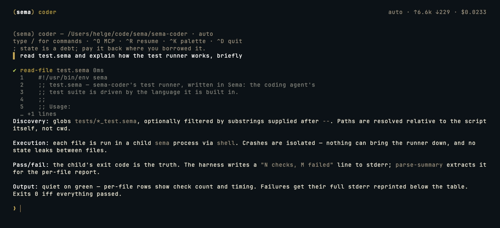

<div align="center">


# Sema Coder

**A terminal coding agent written entirely in [Sema](https://sema-lang.com)** — a Lisp with first-class LLM primitives.

[](https://github.com/sema-lisp/sema-coder/actions)
[](LICENSE)
[](https://sema-lang.com)
[](https://sema-lang.com)

</div>

Sema Coder is the reference application for **Sema as an application runtime**: the
agent loop, tools, slash commands, the full-screen TUI, theming, and config all
live in Sema. Only a thin layer of host primitives (terminal screen control, path
safety) is Rust. It depends on nothing but the `sema` binary.



## Requirements

- **`sema` ≥ 1.37** — during the prerelease period, install with
  `cargo install sema-lang --version 1.37.0-rc.1`. After 1.37.0 is released,
  use `curl -fsSL https://sema-lang.com/install.sh | sh`,
  `brew install helgesverre/tap/sema-lang`, or `cargo install sema-lang`.
- **An API key** — `ANTHROPIC_API_KEY` or `OPENAI_API_KEY` in the environment.
- Optional: **`rg`** (ripgrep) — the grep tool prefers it, falling back to `grep`.
- Optional: **`jake`** — enables the `coder.run`, `coder.ask`, `coder.test`,
  `coder.e2e`, and `coder.help` recipes from the workspace root.

## Run

```bash
# Interactive (full-screen TUI on a TTY)
./coder.sema                     # or: sema coder.sema

# One-shot (prose to stdout, pipeable)
./coder.sema -- -p "explain this codebase"

# One-shot structured result (exactly one JSON document on stdout)
./coder.sema -- --json -p "explain this codebase"

# Override the model
./coder.sema -- -m claude-haiku-4-5

# Pipe context in: stdin is appended to the prompt inside a <stdin> block
git diff | ./coder.sema -- -p "review this change"
```

If the workspace root has an `AGENTS.md` or `CLAUDE.md`, its contents are added
to the system prompt (each capped at 32 KB) so project conventions apply without
pasting them in.

`./coder.sema` works because the file is `chmod +x` with a `#!/usr/bin/env sema`
shebang. If stdin is not a TTY and `--print` is absent, Sema Coder runs a plain
line-based REPL instead of the full-screen interface.

| Option | Meaning |
| --- | --- |
| `-m, --model ID` | Override `:model` for this process |
| `-p, --print PROMPT` | Run one turn, print only the response to stdout, and exit |
| `--json` | With `--print`, emit status, response/error, model, effort, usage, and elapsed time as one JSON document |
| `-V, --version` | Print the Sema Coder version |
| `-h, --help` | Print CLI help |

The `--` before these options separates Sema interpreter arguments from Sema
Coder arguments.

## Architecture

```text
sema-coder/
├── coder.sema          Entry point — CLI parsing, boot, REPL/TUI dispatch
├── src/
│   ├── agent.sema      System prompt + agent construction
│   ├── banner.sema     Wordmark + welcome (on-brand gold)
│   ├── cli.sema        Argument parsing + usage text
│   ├── commands.sema   Slash-command registry + built-ins
│   ├── config.sema     Config loading (init.sema as Sema data)
│   ├── display.sema    Output sink (emit) + tool-call rendering
│   ├── keymap.sema     Global shortcuts, rebindable via config
│   ├── markdown.sema   Markdown → styled terminal lines
│   ├── mcp.sema        MCP client runtime (connect, tool-merge, autostart)
│   ├── overlay.sema    Modal overlays — MCP manager + session picker
│   ├── selection.sema  Transcript selection, highlighting + clipboard
│   ├── session.sema    Session persistence — conversations as JSONL
│   ├── terminal_input.sema Buffered raw input + terminal event decoder
│   ├── text.sema       Width-aware clip/pad/truncate string helpers
│   ├── theme.sema      Brand palette (sema gold #c8a855)
│   ├── tools.sema      10 LLM-callable tools
│   ├── transcript.sema Transcript blocks → styled lines (cached)
│   ├── turn.sema       Interrupted-turn history repair + control markers
│   ├── tui.sema        Full-screen TUI — frame-diffed, async agent turns
│   └── util.sema       Workspace path resolution + shell quoting
├── test.sema           Test runner (Sema running Sema)
├── tests/              The test files + harness
└── docs/               Design notes; dated plans live in docs/plans/
```

It is built on Sema's own primitives: `agent` / `deftool` / `agent/run` (the LLM
agent loop), `async` / `async/cancel` (concurrent turns), `make-parameter` /
`parameterize` (output and test seams), `mutable-array/*` (streaming state),
`file/*` and `shell` (tools), `json/*` (sessions and diagnostics), `term/*`
(theming and screen control), `path/within?` (workspace path resolution), and
`llm/session-usage` (the token/cost HUD).

In the TUI, an agent turn runs as an async task while a sibling task keeps pumping
input, so scrolling, resize, and type-ahead all work while tokens stream in, and
**Ctrl-C interrupts the turn** without killing the app. While a turn runs,
**Tab queues** a FIFO follow-up and **Enter interrupts and sends** the typed
message after cancellation is acknowledged. The queue has stable ids, is
visible above the prompt, and is saved with the session. An interruption pauses
ordinary queued work when any exists; `/queue resume` continues it. While the
slash-command palette is open, `Tab` completes the selected entry instead of
queueing the prompt.

Drag across transcript text to select and copy it automatically. Double-click
selects a word or punctuation run; triple-click selects a rendered line.
The highlight clears on mouse release; Shift-drag remains available for the
terminal's native selection. Clipboard copy uses the platform command locally
and OSC52 under SSH/tmux or as a fallback.

## Slash commands

Type `/` in the TUI to open the fuzzy command palette. Argument completions show
the value that will be inserted first, followed by its description. `Tab`
inserts the selected completion; `Enter` runs it.

| Command | Scope | Description |
| --- | --- | --- |
| `/help` | All interactive modes | List built-in, configured, and plugin commands |
| `/model [ID]` | TUI / REPL | Show the current model and catalog, or switch models; manually typed IDs are accepted |
| `/effort [LEVEL\|default]` | TUI / REPL | Show or set reasoning effort: `none`, `minimal`, `low`, `medium`, `high`, or `xhigh`; `default` removes the session override |
| `/clear` | TUI / REPL | Clear conversation history; the TUI also clears the transcript and starts a new session |
| `/tools` | TUI / REPL | List built-in, autoloaded, and connected MCP tools; MCP tools include their server name |
| `/queue` | TUI | List queued follow-ups and their stable IDs |
| `/queue resume` | TUI | Resume queued work after an interruption |
| `/queue clear` | TUI | Remove all queued messages and clear the paused state |
| `/queue drop ID` | TUI | Remove one queued message |
| `/queue edit ID TEXT` | TUI | Replace the text of one queued message without changing its ID or order |
| `/mcp` | TUI / REPL | Open the MCP manager in the TUI; print server status in the plain REPL |
| `/resume [ID]` | TUI / REPL | Open or print the session list, or restore a session directly by ID |
| `/resume rename ID TITLE` | TUI / REPL | Give a saved session a durable custom title |
| `/resume delete ID` | TUI / REPL | Delete a saved session; the active TUI session cannot be deleted |
| `/cwd` | TUI / REPL | Print the workspace directory |
| `/config` | TUI / REPL | Print the active `init.sema` path |
| `/config edit` | TUI / REPL | Open `init.sema` with `$VISUAL`, `$EDITOR`, or the platform text-file opener |
| `/reload` | TUI / REPL | Reload and validate config, then reconcile commands, hooks, MCP servers, tools, and the agent |
| `/quit`, `/exit` | All interactive modes | Exit Sema Coder |

`/model` completes from the config's `:models` list. The active model is marked
`●`; a known provider without its API key is marked `· no key`. Model selection
also changes the active provider when the model belongs to a configured
provider group. Any model ID typed by hand remains valid.

### Diagnostics

Developer-only inspection is namespaced under `/debug` so diagnostic names do
not occupy top-level command names. JSON output is indented and spans multiple
lines.

| Command | Scope | Output |
| --- | --- | --- |
| `/debug` | TUI / REPL | List available diagnostics |
| `/debug status` | TUI / REPL | Turn status, active phase/tool, queue, session ID, and ordered controller events; the REPL reports its idle status and message count |
| `/debug session` | TUI / REPL | Effective model and effort, exact in-memory messages, session metadata, queued input, and paused state |
| `/debug transcript` | TUI | Transcript blocks plus render-cache state and counters |
| `/debug tasks` | TUI / REPL | Background task state plus retained stdout, stderr, exit codes, timing, and truncation flags |
| `/debug doctor` | TUI / REPL | Secret-safe checks for Sema compatibility, provider keys, config, session storage, ripgrep, MCP, and model resolution |

`/debug session`, `/debug transcript`, and `/debug tasks` can include full
prompts, commands, tool arguments, tool results, and process output. Review
their output before sharing it.

`--json` is valid only with `--print`. Structured mode suppresses tool rendering
and lifecycle hooks so user code cannot add text to stdout. A successful result
uses `status: "completed"` and `response`; a failed result uses
`status: "failed"` and `error`, then exits non-zero. Startup diagnostics remain
on stderr where applicable.

## Configuration

Config is **Sema data, not JSON** — an `init.sema` file that calls
`(configure! (coder-config {…}))`. It is created (annotated) on first run,
and lives at:

```text
<app-config-dir>/init.sema
```

`<app-config-dir>` is `$SEMA_CODER_CONFIG_DIR` when set. Otherwise it is
`<OS-config-dir>/sema/sema-coder` (`~/Library/Application Support/sema/sema-coder`
on macOS; below `$XDG_CONFIG_HOME` or `~/.config` on Linux). Run `/config` to
print the exact path, or `/config edit` (or `e` in the `⌃O` modal) to open it.

The TUI watches `init.sema` and applies a valid save after a short debounce.
Malformed or invalid config leaves the complete last-good runtime active and
shows a persistent error banner. The plain REPL does not watch the file; use
`/reload` there. A successful apply replaces config-owned commands, hooks, and
MCP declarations, reloads the tool directory, applies key changes, and rebuilds
the agent. Unknown top-level keys produce warnings instead of failing the load.

A complete `init.sema`:

```scheme
(configure!
  (coder-config
    {:model      "claude-opus-5" ; default model; "" = auto-detect from API keys
     :effort     ""          ; reasoning effort (none…xhigh); "" = provider default
     :max-turns  50          ; max tool-use rounds in a single turn
     :tool-preview-lines 5   ; result lines shown under each tool call

     ;; Models offered by the /model autocomplete, grouped by provider.
     ;; Only a picker list — any model id typed by hand still works. A model
     ;; may carry per-model defaults: (model id label {:effort "high"}).
     :models
     (list
       (provider "Anthropic"
         (list
           (model "claude-opus-5"    "Claude Opus 5")
           (model "claude-fable-5"   "Claude Fable 5")
           (model "claude-opus-4-8"  "Claude Opus 4.8")
           (model "claude-sonnet-5"  "Claude Sonnet 5")
           (model "claude-haiku-4-5" "Claude Haiku 4.5")))
       (provider "OpenAI"
         (list
           (model "gpt-5.6-sol"   "GPT-5.6 Sol")
           (model "gpt-5.6-terra" "GPT-5.6 Terra")
           (model "gpt-5.6-luna"  "GPT-5.6 Luna")
           (model "gpt-5.5"       "GPT-5.5"))))

     ;; MCP servers — each is a value; manage connections in the /mcp modal (⌃O).
     :mcp-servers
     (list
       ;; stdio: a local process speaking MCP over stdin/stdout
       (mcp-server "sema" {:command "sema" :args ["mcp" "--include" "eval,docs,docs_search"]
                           :autostart #t})           ; connect at boot
       ;; http: a remote endpoint (OAuth is prompted when you connect)
       (mcp-server "asana" {:url "https://mcp.asana.com/mcp"}))

     ;; Custom slash commands — argv (no shell), a template, or a Sema handler.
     :commands
     (list
       (command "test" {:desc "run tests"    :run ["make" "test"]})
       (command "log"  {:desc "git log"      :run ["git" "log" "--oneline" "-n" :args]})
       (command "diff" {:desc "wc diff"      :shell "git diff $ARGS"})
       (command "hi"   {:desc "greet" :keep-input #t
                         :do (lambda (state args) (emit :info "hi!") state)}))

     ;; Lifecycle observers. A handler receives one context map; its return
     ;; value is ignored, and an exception does not stop the agent.
     :hooks
     (list
       (hook :turn-interrupted
         (lambda (ctx)
           (file/write "last-interrupted-turn.txt" (:turn-id ctx)))))

     ;; Rebind any keyboard action (defaults shown in the table below).
     :keys {}}))               ; e.g. {:mcp "ctrl-p" :resume "ctrl-j"}
```

All recognized top-level keys are listed below. List fields also accept vectors.

| Key | Generated first-run value | Meaning |
| --- | --- | --- |
| `:model` | `"claude-opus-5"` | LLM model; `""` auto-detects from `ANTHROPIC_API_KEY` / `OPENAI_API_KEY` |
| `:effort` | `""` | Reasoning effort (`none`/`minimal`/`low`/`medium`/`high`/`xhigh`); `""` = provider default |
| `:max-turns` | `50` | Positive integer limiting agent tool-use rounds per user turn |
| `:tool-preview-lines` | `5` | Positive integer limiting result lines shown under each settled tool call in the TUI |
| `:models` | Anthropic and OpenAI catalog | `(provider …)` groups of `(model …)` records used by completion, API-key hints, and provider routing |
| `:mcp-servers` | Autostarted local Sema MCP server | List of `(mcp-server …)` records; `coder-config` itself falls back to an empty list when no generated file is used |
| `:commands` | Example `/test` command | List of `(command …)` records; `coder-config` itself falls back to an empty list |
| `:hooks` | `'()` | List of `(hook EVENT HANDLER)` lifecycle observers |
| `:keys` | `{}` | Action → key overrides |

Model precedence is: the process `--model` or current `/model` override, then
`:model`, then provider auto-detection when the value is empty. Effort
precedence is: current `/effort` override, the selected model record's optional
`:effort`, then top-level `:effort`, then the provider default.

### MCP servers

Each server is a `(mcp-server "name" opts)` value. `opts` is either a **stdio**
launcher (`:command` + `:args`) or an **http** endpoint (`:url`), plus the
optional app key `:autostart`:

```scheme
(mcp-server "fs" {:command "npx" :args ["-y" "@modelcontextprotocol/server-filesystem" "."]})
(mcp-server "asana" {:url "https://mcp.asana.com/mcp"})   ; OAuth on connect
```

`:autostart #t` connects at boot; otherwise you connect on demand. Manage
connections in the `/mcp` modal (`⌃O`): `↑↓` select, `c` connect, `d` disconnect,
`t` list a server's tools, `e` edit `init.sema`. A server that needs auth shows a
`▲` — connect it to run the sign-in flow. Connecting merges that server's tools
into the agent for the rest of the session (only add servers you trust — they run
real commands and reach real services).

Tool names are unique: a built-in wins over an MCP tool of the same name, and
between servers the first connected wins. `/tools` lists any dropped names.
The handshake is bounded by `:connect-timeout-ms` in the server options
(default 15000); a server that does not answer in time shows
`connect timed out after N ms` in the MCP manager.

### Custom commands

A `(command "name" spec)` becomes `/name`. The `spec` carries `:desc`, an
optional `:key` (a keyboard shortcut that fires the command, e.g.
`:key "ctrl-t"`), optional `:keep-input #t`, plus **exactly one** handler:

- `:run` — an **argv list** run in the workspace, never shell-interpreted (the
  safe default). The keyword `:args` marks where the text you type after the
  command is spliced (dropped if you type nothing); without `:args` it is
  appended. `["git" "log" "-n" :args]` + `/log 5` → `git log -n 5`.
- `:shell` — a **template string** with `$ARGS` substituted, run via the shell.
- `:do` — a **Sema handler** `(lambda (state args) … )` returning the next state
  (or the symbol `quit`); write output with `(emit :info "…")`.

`:keep-input #t` prevents the TUI palette from clearing the prompt before the
handler runs. It is intended for commands that read or rewrite the live prompt.

Config commands hot-reload — removing one from `init.sema` unregisters it. You
can also register commands at runtime from Sema, after loading `src/commands.sema`:

```scheme
(register-command! "hello" "Say hi"
  (lambda (state args) (emit :info "hi!") state))
```

A command can also register **argument completions** — the palette switches to
them once you type `/name ` (this is how `/model`, `/effort`, `/resume`, and
`/config` offer theirs). The function receives the live state map (`:config`,
`:model`, `:effort`, …). The palette shows `:value` first and `:label` as its
description; an entry with `:active #t` is marked `●`:

```scheme
(register-completions! "hello"
  (lambda (state)
    (list {:value "world" :label "the whole world" :active #t}
          {:value "mom"   :label "hi mom"})))
```

### Hooks

Declare lifecycle hooks in `:hooks` with `(hook EVENT HANDLER)`. Handlers run in
declaration order, receive one context map, and have their return value ignored.
An exception is caught so one hook cannot stop the turn or later hooks.

| Event | Context | When it runs |
| --- | --- | --- |
| `:session-start` | `{:cwd}` | The process starts a TUI, plain REPL, or one-shot session |
| `:pre-turn` | `{:input :messages}` | Immediately before `agent/run` |
| `:pre-tool-call` | `{:tool :args}` | When a tool-call start event arrives |
| `:post-turn` | `{:input :result :usage}` | After a turn completes successfully; usage covers this turn only |
| `:on-error` | `{:input :error}` | Before a turn error or cancellation is re-raised |
| `:turn-queued` | `{:entry}` | A TUI follow-up or interrupt-and-send message enters the queue |
| `:turn-interrupted` | `{:input :messages :turn-id}` | The TUI has recovered and persisted an interrupted turn |

Config-owned hooks are replaced on every successful config apply. Plugins can
also call `add-hook!` directly, but a later config reload replaces the hook
registry; use `:hooks` for observers that must survive reloads.

### Keybindings

The keymap is data, merged from four layers (weakest first): the built-in
defaults below → `:key` on command records → the config `:keys` map → runtime
`bind-key!` calls. A key bound to an action that isn't a built-in fires the
like-named slash command, so all of these bind `⌃T` to `/test`:

```scheme
(command "test" {:desc "run tests" :run ["make" "test"] :key "ctrl-t"})  ; on the command
:keys {:test "ctrl-t"}                                                   ; in the :keys map
(bind-key! "ctrl-t" "test")                                              ; from Sema code
```

Rebind built-in actions the same way, e.g. `:keys {:mcp "ctrl-p"}`;
`(unbind-key! action)` drops a runtime bind. Binding one key to two actions
logs a warning at boot/reload (first match wins).

| Action | Default | Does |
| --- | --- | --- |
| `:mcp` | `⌃O` | Open the MCP modal |
| `:resume` | `⌃R` | Open the session picker |
| `:palette` | `⌃K` | Open the slash-command palette |
| `:quit` | `⌃D` | Quit |
| `:interrupt` | `⌃C` | Interrupt the turn / clear input / quit; `⌘C` also interrupts mid-turn when the terminal forwards it |
| `:clear-line` | `⌃U` | Kill the text before the caret on the current line |
| `:kill-word` | `⌃W` | Kill the word before the caret (`⌥⌫` does the same) |
| `:yank` | `⌃Y` | Insert the last killed text at the caret |
| `:expand-tools` | `⌃X` | Toggle full tool results instead of `:tool-preview-lines` previews |
| `:line-start` / `:line-end` | `⌃A` / `⌃E` | Move the caret |
| `:repaint` | `⌃L` | Force a full repaint |

`↑` / `↓` walk the prompt history for this process (newest first); the text
being edited is kept and comes back when you step past the newest entry. In a
multi-line prompt they move between lines first. `Page Up` / `Page Down` and
the mouse wheel scroll the transcript. `Shift-Enter` or `Option-Enter` inserts
a line break; a pasted snippet keeps its line breaks. The prompt grows to six
rows and windows vertically after that. `edit-file` results show the changed
lines as a diff, removed lines red and added lines green.

`Tab` queues a message while a turn is active. `Enter` is a fixed
interrupt-and-send action: it targets the current turn id, saves the pending
message, requests cancellation once, waits for the interrupted terminal event,
then starts the replacement turn. `Ctrl-Enter` remains an alias when the
terminal reports that modified key. These prompt actions are separate from the
configurable global keymap. When the slash-command palette is open, completion
takes priority over queueing on `Tab`.

### Autoloaded tools

Persistent custom tools live in `<app-config-dir>/tools/*.sema`. Files are
loaded in name order at boot and on every successful config apply. A tool-file
edit alone does not trigger the watcher; run `/reload` or save `init.sema` after
editing it. Removed files and replaced registrations take effect at the next
apply.

```scheme
;; <app-config-dir>/tools/echo.sema
(deftool echo
  "Return text unchanged"
  {:text {:type :string :description "Text to return"}}
  (lambda (text) text))

(register-tool! echo)
```

The agent is rebuilt after config apply, so registered tools are available on
the next turn. A bad tool file produces a config warning and does not prevent
other tool files from loading.

### Plugins

Plugins are general Sema extension files loaded once at boot, after
`init.sema`, from these directories in this order:

```text
<app-config-dir>/plugins/*.sema
<cwd>/.sema-coder/plugins/*.sema
```

Files are sorted within each directory; project files load after global files.
Plugins perform registration directly with APIs such as `register-command!`,
`register-completions!`, `register-overlay!`, `add-hook!`, and `bind-key!`.
Restart Sema Coder after editing a plugin. See
[`docs/extension-api.md`](docs/extension-api.md) for the supported API.

### Environment variables

| Variable | Purpose |
| --- | --- |
| `ANTHROPIC_API_KEY` | Configure the Anthropic provider |
| `OPENAI_API_KEY` | Configure the OpenAI provider |
| `SEMA_CODER_CONFIG_DIR` | Override the Sema Coder directory containing `init.sema`, `sessions/`, `tools/`, and global `plugins/` |
| `VISUAL`, then `EDITOR` | Preferred command used by `/config edit` |

## Sessions

The TUI writes every turn to `<app-config-dir>/sessions/<id>.jsonl`. The plain
REPL and one-shot mode do not persist sessions. Each file has a metadata line
followed by one message per line in the exact `agent/run` shape, including tool
calls and tool results. Metadata includes the model, effort, workspace
directory, queued input, paused state, and bounded controller event log. At most
200 sessions are kept; a save deletes the oldest beyond that.

Interrupted turns retain completed tool rounds, currently streamed assistant
text, correlated cancellation results for unfinished tool calls, and a typed
model-visible control item warning that side effects can be partial. `/resume`
or `⌃R` opens a newest-first picker scoped to the current workspace; `Tab`
switches between this workspace and all sessions, where other projects show
their directory name. Typing filters by title, ID, or model;
`Backspace` edits the query, `Enter` previews, `⌃R` restores, `⌃E` renames, and
`Delete` twice removes the selected saved session. `/resume ID` restores directly
and brings back its model, effort, custom title, queue, paused state, events, and
exact message history. The slash-command palette also completes rename and delete
forms from the current saved-session list.

## Tools

| Tool | Purpose and limits |
| --- | --- |
| `read-file` | Read a numbered line window; defaults to 2,000 lines and caps returned text at 100,000 characters; refuses files over 2 MB and binary files |
| `write-file` | Create or overwrite a file, creating parent directories |
| `edit-file` | Replace one exact string; requires a unique match unless `replace_all` is true; the result carries a line diff of each replacement |
| `bash` | Run a foreground shell command in the workspace with a default 120-second timeout, or set `background=true` to return an application-owned task ID immediately |
| `task-output` | Read a background task's retained stdout/stderr and status; optionally wait up to a caller-set deadline |
| `task-list` | List background task IDs, commands, state, timing, exit codes, output sizes, and truncation flags |
| `task-stop` | Terminate one background task; on Unix, this also terminates descendant processes |
| `grep` | Search contents with ripgrep or grep; supports case-insensitive and glob filters and returns at most 100 lines |
| `find-files` | Find names by glob while skipping `.git`, `node_modules`, and `target`; returns at most 200 lines |
| `list-dir` | List one directory with types and sizes |

Every **path** — including the search tools' — resolves through `path/within?`,
which keeps reads, writes, and searches inside the workspace root (catching both
`../` and symlink escapes). The search tools invoke `rg`/`grep`/`find`/`ls`
argv-style, so patterns are never shell-interpreted.

**This is accident prevention, not a sandbox.** The `bash` tool runs real shell
commands with your privileges, unrestricted — the path check above applies only
to the file/search tools. Treat a session like you'd treat any coding agent:
run it in a workspace you're prepared to let it modify.

Background commands are non-interactive: Sema Coder closes their stdin at
launch. They continue across normal turns and agent-turn interruption, but they
are not persisted across app restart and are stopped when Sema Coder exits.
When one completes, fails, or is stopped, the TUI adds one lifecycle notice with
its task ID, elapsed time, and exit code; retained output remains under
`task-output` and `/debug tasks`.
Each stdout and stderr stream retains a bounded 25,000-character head and
25,000-character tail; `task-output` and `/debug tasks` report omitted content.
Use background mode for servers, file watchers, or independent long-running
commands. Do not append `&` or enable the command's own daemon mode;
`background=true` already owns the process tree. Keep a command in the
foreground when its result is required before the next agent step.

## Development

```bash
./test.sema                       # full suite (or: jake coder.test)
./test.sema -- markdown keymap     # test files matching either term
jake coder.run                     # interactive app
jake coder.ask q='explain this'    # one-shot prompt
jake coder.e2e                     # controller + process-level tests
jake coder.live-smoke scenario=complete model=MODEL_ID
jake coder.help                    # CLI help
```

The runner is itself Sema — it runs each `tests/*_test.sema` in a child
interpreter (crashes stay contained, no state leaks between files) and
reports per-file checks and timings; failing files get their full output.
Tests sit on a tiny `check`/`check-true`/`check-contains` harness
(`tests/harness.sema`); each file ends with `(done)`, exiting non-zero on
failure. A passing child must also print the harness summary, so forgetting
`(done)` cannot produce a false green result. Each child has a 30-second timeout
(override with `SEMA_CODER_TEST_TIMEOUT_MS`). Turn-controller tests inject a
scripted runner and no-op renderer, so queue, steer, cancellation, late-delta,
partial-history, and event-order races need no network or terminal. Design
notes are in `docs/` (dated planning documents are archived under `docs/plans/`;
`docs/language-friction.md` tracks upstream sema issues this app found, with
their fix status).

Live provider interruption checks are opt-in and are not discovered by the
default runner:

```bash
sema tests/live_interrupt_smoke.sema -- failure
SEMA_CODER_LIVE=1 sema tests/live_interrupt_smoke.sema -- complete
SEMA_CODER_LIVE=1 sema tests/live_interrupt_smoke.sema -- foreground
SEMA_CODER_LIVE=1 sema tests/live_interrupt_smoke.sema -- steer
SEMA_CODER_LIVE=1 sema tests/live_interrupt_smoke.sema -- background
```
Set `SEMA_CODER_LIVE_MODEL` to override the configured default model for a live
scenario. The deterministic `failure` scenario needs no provider or API key.

Set `SEMA_CODER_TEST_TIMEOUT_MS` to a positive millisecond value to override the
test runner's 30-second per-file timeout.

## License

MIT
